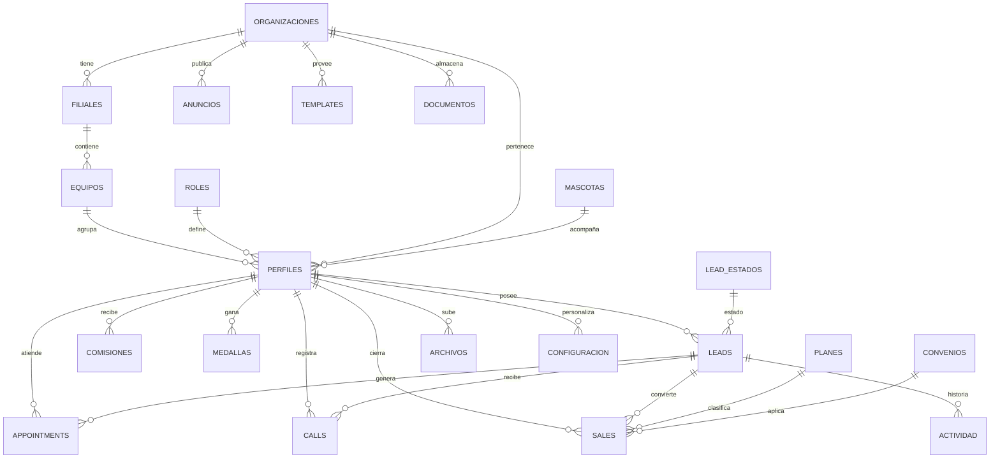

# ARQUITECTURA FASE 2 — Plataforma Multiusuario y Migración a Supabase
> Documento de **diseño y planificación**. No contiene implementación. No modifica funcionalidades existentes. No migra datos.
> Base: auditoría previa + inventario real del código (`js/db.js`, `js/constants.js`, `js/utils.js`, `docs/PROJECT_CONTEXT.md`, `docs/BUSINESS_RULES.md`).
> Versión del documento: 1.0 — Junio 2026 · Proyecto: CRM Comercial 3.x

---

## 0. Resumen ejecutivo

El sistema actual es una PWA modular en Vanilla JS con persistencia **100% local (IndexedDB `AgendaComercialDB` v2)**. Funciona bien para un solo asesor en un solo dispositivo, pero **no sincroniza** y **no soporta multiusuario, equipos ni jerarquías**.

La propuesta **no reescribe** la aplicación. Se introduce una **capa de servicios** (ya prevista en el ROADMAP, Fase 6) que desacopla los módulos de IndexedDB. Detrás de esa capa coexisten dos backends: el local actual (offline) y **Supabase** (Postgres + Auth + Storage + Realtime) como fuente de verdad en la nube. El modelo es **offline-first con sincronización**: la app sigue funcionando sin red y reconcilia al reconectar.

La complejidad global se estima **Media-Alta**, repartida en fases incrementales y reversibles. El mayor riesgo no es técnico sino de **integridad de datos durante la migración** (los `id` autoincrement locales no son globalmente únicos). Se mitiga con una estrategia de claves UUID y una migración asistida, no destructiva.

---

## 1. Estado actual (línea base verificada)

### 1.1 Almacenes IndexedDB existentes

| Store | Llave | Índices | Rol actual |
|-------|-------|---------|-----------|
| `appointments` | `id` (autoincrement) | `fecha`, `estado` | Citas/agenda |
| `leads` | `id` (autoincrement) | `estado`, `fechaCreacion` | Prospectos y leads (incluye `historial[]` embebido) |
| `calls` | `id` (autoincrement) | `leadId`, `apptId`, `fecha` | Registro de llamadas |
| `sales` | `id` (autoincrement) | `fecha`, `plan` | Ventas cerradas |
| `templates` | `id` (string) | — | Plantillas WhatsApp |
| `config` | `key` (string) | — | Preferencias del asesor (key-value) |

### 1.2 Datos derivados (hoy NO se almacenan, se calculan al vuelo)

`js/utils.js` calcula en tiempo real, a partir de `sales`:
- **Comisiones** (`calcMonthComision`), **incentivos semanales** (`calcIncentiveSemanal`)
- **BPI** mensual (`calcBPI`)
- **Medallas** (`calcTotalMedallas` — 1 cada 4 ventas/semana) y **Niveles** (`calcNivel` — 1 cada 5 medallas)

> Implicación de diseño: en multiusuario, las reglas de comisión **cambian con el tiempo y por filial**. Calcular siempre "al vuelo" produciría cifras históricas inconsistentes. Por eso el nuevo modelo **materializa** comisiones/BPI/medallas como *snapshots* mensuales, conservando además el cálculo dinámico para el mes en curso.

### 1.3 Catálogos y constantes (hoy en código)
`PLANES`, `CONVENIOS`, `LEAD_ESTADOS`, `CARGOS`, `MASCOTAS` viven en `js/constants.js`. En multiusuario, **planes/comisiones/convenios deben ser datos** (tabla configurable por organización), no constantes compiladas, para que cada filial ajuste valores sin redeploy.

### 1.4 Límite principal
Datos locales, sin identidad de usuario, sin sincronización entre dispositivos ni visibilidad jerárquica. Todo lo demás de la arquitectura modular es **válido y reutilizable**.

---

## 2. Arquitectura propuesta (entregable 1)

### 2.1 Principios

1. **Offline-first.** IndexedDB deja de ser "la base de datos" y pasa a ser **caché local + cola de cambios**. Supabase es la fuente de verdad.
2. **No romper nada.** Se introduce una `services/` que expone la misma firma que hoy usan los módulos (`leads.add()`, `appointments.getAll()`, etc.). Los módulos no se reescriben.
3. **Multi-tenant desde el día uno.** Toda fila cuelga de una `organizacion_id`. La seguridad vive en la base de datos (RLS de Postgres), no solo en el frontend.
4. **Datos, no código.** Planes, comisiones, estados y convenios se vuelven tablas configurables.
5. **Preparado para API/IA/móvil nativo** sin reconstruir: Supabase ya expone REST y Realtime; una futura app nativa consume el mismo backend.

### 2.2 Capas

```
┌──────────────────────────────────────────────────────────────┐
│  VISTAS / MÓDULOS (sin cambios funcionales)                   │
│  agenda · leads · dashboard · ventas · medallas · whatsapp…   │
└───────────────▲──────────────────────────────────────────────┘
                │  misma firma de siempre (leads.add, etc.)
┌───────────────┴──────────────────────────────────────────────┐
│  CAPA DE SERVICIOS  services/*.service.js   (NUEVA)           │
│  - Orquesta lectura/escritura                                 │
│  - Decide: ¿hay red? → Supabase ; ¿no? → IndexedDB + cola     │
│  - Normaliza modelos (UUID, organizacion_id, owner_id)        │
└──────▲───────────────────────────────────────▲───────────────┘
       │                                        │
┌──────┴───────────────┐            ┌───────────┴──────────────┐
│  ADAPTER LOCAL        │            │  ADAPTER REMOTO          │
│  IndexedDB (caché +   │◄──sync──►  │  Supabase Client         │
│  outbox de cambios)   │            │  (Auth/Postgres/Storage/ │
│                       │            │   Realtime)              │
└──────────────────────┘            └──────────▲───────────────┘
                                                │ RLS + Policies
                                     ┌──────────┴───────────────┐
                                     │  POSTGRES (Supabase)     │
                                     │  multi-tenant + jerarquía│
                                     └──────────────────────────┘
```

### 2.3 Componentes nuevos (carpetas)

```
services/        ← capa de datos unificada (local + remoto)
  ├── supabase.client.js     conexión + sesión
  ├── sync.engine.js         cola outbox, reconciliación, Realtime
  ├── auth.service.js        login, sesión, perfil, rol
  ├── leads.service.js       adapter sobre db.leads + supabase
  ├── appointments.service.js
  ├── calls.service.js
  ├── sales.service.js
  ├── comisiones.service.js  snapshots + cálculo
  └── catalogs.service.js    planes, estados, convenios, mascotas
auth/            ← UI de login / selección de organización
config/          ← entorno, claves públicas Supabase, feature flags
```

### 2.4 Estrategia de sesión y tenant
- Login vía **Supabase Auth** (email/contraseña o magic link; OAuth Google opcional a futuro).
- Tras login, se resuelve `perfil` → `organizacion_id`, `cargo`, `filial_id`, `equipo_id`.
- Todas las consultas quedan automáticamente acotadas por **RLS** según ese contexto. El frontend nunca decide solo qué puede ver el usuario; la base lo refuerza.

---

## 3. Usuarios, roles y permisos (entregable 4)

### 3.1 Jerarquía de cargos (de mayor a menor alcance)

| Nivel | Cargo | Alcance de datos | Edición | Reportes |
|------:|-------|------------------|---------|----------|
| 7 | **CEO** | Toda la organización (todas las filiales) | Todo + configuración global | Todos, consolidados |
| 6 | **Director** | Toda la organización | Todo excepto facturación/owner de cuenta | Todos, consolidados |
| 5 | **Sales Manager** | Una o varias filiales asignadas | Datos comerciales de sus filiales | Por filial y equipo |
| 4 | **Gerente** | Una filial | Datos de su filial | Por filial y equipo |
| 3 | **Jefe de Grupo** | Un equipo | Datos de su equipo + reasignar leads del equipo | Por equipo |
| 2 | **Full Executive** | Propios (+ lectura de equipo, configurable) | Sus propios registros | Propios + comparativa de equipo (solo lectura) |
| 1 | **Asesor Training** | Solo propios | Edición limitada (no borra, no exporta masivo) | Solo propios |

### 3.2 Matriz de permisos (resumen)

| Acción | Asesor Training | Full Executive | Jefe de Grupo | Gerente | Sales Manager | Director | CEO |
|--------|:-:|:-:|:-:|:-:|:-:|:-:|:-:|
| Ver leads propios | ✅ | ✅ | ✅ | ✅ | ✅ | ✅ | ✅ |
| Ver leads de su equipo | — | 👁️ | ✅ | ✅ | ✅ | ✅ | ✅ |
| Ver leads de la filial | — | — | — | ✅ | ✅ | ✅ | ✅ |
| Ver leads de toda la org | — | — | — | — | ◑ | ✅ | ✅ |
| Crear/editar lead propio | ✅ | ✅ | ✅ | ✅ | ✅ | ✅ | ✅ |
| Reasignar lead | — | — | ✅ (equipo) | ✅ (filial) | ✅ | ✅ | ✅ |
| Borrar registros | — | propios | equipo | filial | filial | ✅ | ✅ |
| Importación masiva | — | ✅ | ✅ | ✅ | ✅ | ✅ | ✅ |
| Exportar reportes | propios | propios | equipo | filial | filial | ✅ | ✅ |
| Registrar venta | ✅ | ✅ | ✅ | ✅ | ✅ | ✅ | ✅ |
| Ajustar/aprobar comisiones | — | — | propone | aprueba (filial) | aprueba | ✅ | ✅ |
| Configurar planes/convenios | — | — | — | — | filial | ✅ | ✅ |
| Gestionar usuarios/roles | — | — | — | filial | filial | ✅ | ✅ |
| Publicar anuncios | — | — | equipo | filial | filial | ✅ | ✅ |
| Ver dashboard ejecutivo | — | — | equipo | filial | multi-filial | global | global |

> 👁️ = lectura · ◑ = solo filiales asignadas. La fila "Ver leads de equipo" para Full Executive es un **flag por organización** (`config.visibilidad_equipo`), porque algunas empresas prefieren competencia individual y otras transparencia de equipo.

### 3.3 Implementación de seguridad (diseño, no código)
- **RLS de Postgres** por tabla. La política base evalúa una función `puede_ver(fila)` que compara la jerarquía del usuario con `organizacion_id` / `filial_id` / `equipo_id` / `owner_id` de la fila.
- **Roles como datos** (tabla `roles`) + asignación en `perfiles`, para permitir cargos personalizados a futuro sin tocar código.
- El frontend solo **oculta** lo que el usuario no puede tocar (UX); la base **impide** el acceso (seguridad real).

---

## 4. Filiales y equipos (entregable 4, organizacional)

### 4.1 Modelo jerárquico
```
Organización (tenant)
└── Filial (ej: Santiago, Talca)
    └── Equipo (ej: Equipo A, Equipo B)
        └── Usuario (perfil con cargo)
```

- Una **organización** agrupa todo (multi-tenant). Cada empresa cliente del CRM es una organización aislada.
- Una **filial** pertenece a una organización. Un usuario pertenece a una filial.
- Un **equipo** pertenece a una filial. Un usuario pertenece a un equipo (salvo Gerentes/Directores que pueden no tener equipo).
- **Visibilidad** se deriva de esta jerarquía vía RLS (sección 3).

### 4.2 Casos especiales
- **Sales Manager multi-filial:** tabla puente `sales_manager_filiales` (N:M) para asignar varias filiales a un mismo cargo.
- **Reasignación:** un lead puede cambiar de `owner_id` (ejecutivo) sin perder su historial; el cambio queda en `actividad`.
- **Bajas:** usuarios se marcan `activo=false` (soft delete) para conservar histórico de ventas/comisiones.

---

## 5. Modelo de datos completo (entregable 3)

> Diseño Postgres/Supabase. Tipos: `uuid`, `text`, `int`, `numeric`, `bool`, `timestamptz`, `date`, `jsonb`. Toda tabla lleva `organizacion_id` (tenant), `created_at`, `updated_at`. Claves primarias **UUID** (`gen_random_uuid()`).

### 5.1 Núcleo de identidad y organización

**`organizaciones`**
| Campo | Tipo | Notas |
|-------|------|-------|
| id | uuid PK | tenant raíz |
| nombre | text | |
| plan_suscripcion | text | free/pro/enterprise (a futuro) |
| config | jsonb | flags globales (ej. `visibilidad_equipo`) |
| created_at / updated_at | timestamptz | |

**`filiales`**
| id | uuid PK |
| organizacion_id | uuid FK → organizaciones |
| nombre | text |
| ciudad | text |
| activo | bool |
*Índices:* `(organizacion_id)`.

**`equipos`**
| id | uuid PK |
| organizacion_id | uuid FK |
| filial_id | uuid FK → filiales |
| nombre | text |
| jefe_id | uuid FK → perfiles (nullable) |
| activo | bool |
*Índices:* `(filial_id)`, `(organizacion_id)`.

**`roles`**
| id | uuid PK |
| organizacion_id | uuid FK (nullable = rol global del sistema) |
| nombre | text | (CEO, Director, … Asesor Training) |
| nivel | int | 1–7, define jerarquía |
| permisos | jsonb | matriz de permisos serializada |

**`perfiles`** (extiende `auth.users` de Supabase)
| id | uuid PK = auth.users.id |
| organizacion_id | uuid FK |
| filial_id | uuid FK (nullable) |
| equipo_id | uuid FK (nullable) |
| rol_id | uuid FK → roles |
| nombre | text |
| apellido | text |
| email | text |
| telefono | text |
| avatar_url | text | (Supabase Storage) |
| mascota_id | text FK → mascotas |
| activo | bool |
*Índices:* `(organizacion_id)`, `(equipo_id)`, `(filial_id)`, `(rol_id)`.

**`sales_manager_filiales`** (N:M)
| perfil_id | uuid FK | filial_id | uuid FK | → asignación multi-filial |

### 5.2 Comercial

**`leads`** ← evoluciona el store `leads`
| Campo | Tipo | Origen actual |
|-------|------|---------------|
| id | uuid PK | (era int autoincrement) |
| organizacion_id / filial_id / equipo_id | uuid FK | nuevo |
| owner_id | uuid FK → perfiles | nuevo (ejecutivo dueño) |
| nombre, apellido | text | igual |
| telefono, email | text | igual (validar/normalizar) |
| ciudad, empresa, cargo | text | igual |
| producto_interes, categoria_interes | text | igual |
| presupuesto | numeric | igual |
| nivel_interes | text | Alto/Medio/Bajo |
| origen | text | Facebook/Instagram/Referido/… |
| estado | text FK → lead_estados | igual |
| observaciones | text | igual |
| es_prospecto | bool | nuevo (staging de importación) |
| agendado | bool | igual |
| created_at / updated_at | timestamptz | era fechaCreacion/Actualizacion |
*Índices:* `(organizacion_id, estado)`, `(owner_id)`, `(equipo_id)`, `(telefono)`, `(email)`.
> El `historial[]` embebido se **externaliza** a la tabla `actividad` (5.6).

**`appointments`** (agenda) ← store `appointments`
| id | uuid PK |
| organizacion_id / filial_id / equipo_id | uuid FK |
| owner_id | uuid FK → perfiles |
| lead_id | uuid FK → leads (nullable) |
| nombre, telefono, interes | text |
| fecha | date · hora | text/time |
| duracion | int | minutos |
| estado | text | Pendiente/Asistió/No asistió/Contrató/No interesado/Reagendada |
| origen_lead | text |
| zoom_link | text |
| created_at / updated_at | timestamptz |
*Índices:* `(organizacion_id, fecha)`, `(owner_id, fecha)`, `(estado)`, `(lead_id)`.

**`calls`** (llamadas) ← store `calls`
| id | uuid PK |
| organizacion_id | uuid FK |
| owner_id | uuid FK |
| lead_id | uuid FK (nullable) |
| appointment_id | uuid FK (nullable) |
| fecha | date · hora | time |
| duracion | int | segundos |
| resultado | text | Contestó/No contestó/Buzón/Reagendar/Interesado/No interesado |
| observaciones | text |
*Índices:* `(lead_id)`, `(appointment_id)`, `(owner_id, fecha)`.

**`sales`** (ventas) ← store `sales`
| id | uuid PK |
| organizacion_id / filial_id / equipo_id | uuid FK |
| owner_id | uuid FK |
| lead_id | uuid FK (nullable) |
| plan_id | text FK → planes |
| beca | bool |
| convenio | text FK → convenios (nullable) |
| monto | numeric |
| comision | numeric | **congelada al momento de la venta** (no recalcular con reglas futuras) |
| fecha | date |
| created_at | timestamptz |
*Índices:* `(organizacion_id, fecha)`, `(owner_id, fecha)`, `(plan_id)`.

### 5.3 Catálogos configurables (antes constantes)

**`planes`** ← `PLANES` de constants.js
| id | text PK | organizacion_id | uuid FK | nombre | text | comision | numeric | descripcion | text | color | text | beca_disponible | bool | es_contado | bool | activo | bool |

**`convenios`** ← `CONVENIOS`
| id | uuid PK | organizacion_id | uuid FK | nombre | text | activo | bool |

**`lead_estados`** ← `LEAD_ESTADOS`
| id | text PK | organizacion_id | uuid FK | nombre | text | orden | int | color | text |

**`mascotas`** ← `MASCOTAS` (catálogo estático compartido)
| id | text PK (aria/titan/zen/max/nova/illidan) | nombre | text | img_url | text | color | text | emoji | text | mensajes | jsonb |
> Selección por usuario vive en `perfiles.mascota_id`.

### 5.4 Compensación (materializada)

**`comisiones`** (snapshot mensual por usuario)
| id | uuid PK |
| organizacion_id / filial_id | uuid FK |
| perfil_id | uuid FK |
| periodo | text | `YYYY-MM` |
| total_ventas | int |
| comision_base | numeric |
| incentivo_semanal | numeric |
| bpi | numeric |
| conectividad | numeric |
| debut | numeric |
| total | numeric |
| estado | text | borrador/aprobada/pagada |
| detalle | jsonb | desglose auditable |
*Índices:* `(perfil_id, periodo)` único, `(filial_id, periodo)`.

**`bpi`** (puede vivir dentro de `comisiones.detalle`, o tabla propia si se requiere histórico fino)
| id | uuid PK | perfil_id | uuid FK | periodo | text | matriculas | int | bpi_unitario | numeric | bpi_total | numeric |

**`medallas`** (snapshot/log de logros)
| id | uuid PK |
| organizacion_id | uuid FK |
| perfil_id | uuid FK |
| tipo | text | medalla/nivel/record |
| periodo | text | semana o mes |
| cantidad | int |
| nivel | int |
| otorgada_at | timestamptz |
*Índices:* `(perfil_id, periodo)`.

### 5.5 Comunicación y configuración

**`templates`** (plantillas WA) ← store `templates`
| id | text PK | organizacion_id | uuid FK | nombre | text | contenido | text | categoria | text | es_default | bool |
> Defaults globales + overrides por organización.

**`configuracion`** (key-value por usuario y por organización) ← store `config`
| id | uuid PK | organizacion_id | uuid FK | perfil_id | uuid FK (nullable = config de org) | key | text | value | jsonb |
*Índices:* `(perfil_id, key)`, `(organizacion_id, key)`.
> Migra `userName`, `cargo`, `filial`, `theme`, `notificaciones`, `debutActivo`, etc.

**`anuncios`** (NUEVO — publicaciones internas)
| id | uuid PK | organizacion_id | uuid FK | filial_id | uuid FK (nullable) | equipo_id | uuid FK (nullable) | autor_id | uuid FK | titulo | text | cuerpo | text | tipo | text | fijado | bool | publicado_at | timestamptz | activo | bool |
*Visibilidad por alcance (org/filial/equipo).*

### 5.6 Trazabilidad y archivos

**`actividad`** (NUEVO — historial unificado / timeline) ← reemplaza `lead.historial[]`
| id | uuid PK |
| organizacion_id | uuid FK |
| perfil_id | uuid FK | (quién hizo la acción) |
| entidad_tipo | text | lead/appointment/sale/call |
| entidad_id | uuid |
| tipo | text | llamada/whatsapp/nota/cambio_estado/reagendar/venta |
| descripcion | text |
| metadata | jsonb |
| created_at | timestamptz |
*Índices:* `(entidad_tipo, entidad_id)`, `(perfil_id, created_at)`.

**`archivos`** (NUEVO — metadatos; binario en Supabase Storage)
| id | uuid PK | organizacion_id | uuid FK | owner_id | uuid FK | entidad_tipo | text | entidad_id | uuid | nombre | text | storage_path | text | mime | text | tamano | int | created_at | timestamptz |

**`documentos`** (NUEVO — biblioteca documental / plantillas comerciales)
| id | uuid PK | organizacion_id | uuid FK | filial_id | uuid FK (nullable) | titulo | text | categoria | text | storage_path | text | version | int | publico | bool | created_at | timestamptz |

### 5.7 Relaciones (resumen)
- `organizaciones` 1—N `filiales` 1—N `equipos` 1—N `perfiles`
- `perfiles` 1—N `leads` / `appointments` / `calls` / `sales` (vía `owner_id`)
- `leads` 1—N `appointments`, `calls`, `sales`, `actividad`, `archivos`
- `perfiles` 1—N `comisiones`, `medallas`
- `planes` / `convenios` / `lead_estados` / `mascotas` = catálogos referenciados
- `roles` 1—N `perfiles`

---

## 6. Diagrama lógico del sistema (entregable 2)

> Diagrama entidad-relación en Mermaid (ver también el panel visual adjunto en el chat).



**Flujo lógico de seguridad (RLS):**
```
Request → Supabase Auth (JWT) → perfil(organizacion_id, cargo/nivel, filial_id, equipo_id)
       → Policy por tabla evalúa nivel vs (owner_id / equipo_id / filial_id / organizacion_id)
       → devuelve solo filas permitidas
```

---

## 7. Estrategia de migración desde IndexedDB (entregable 5)

### 7.1 Mapeo store → tabla

| IndexedDB (hoy) | Supabase (futuro) | Tipo de migración |
|-----------------|-------------------|-------------------|
| `appointments` | `appointments` | Automática + enriquecimiento (owner/filial/equipo/UUID) |
| `leads` | `leads` + `actividad` | Transformación (separar `historial[]`) |
| `calls` | `calls` | Automática + enriquecimiento |
| `sales` | `sales` | Automática + **congelar comisión** |
| `templates` | `templates` | Automática (marca `es_default`) |
| `config` (key-value) | `configuracion` + `perfiles` | Transformación (algunas keys → columnas de perfil) |
| *(constantes en código)* | `planes`, `convenios`, `lead_estados`, `mascotas` | Carga inicial (seed) |
| *(calculado en utils.js)* | `comisiones`, `bpi`, `medallas` | Recálculo histórico → snapshots |

### 7.2 Qué migra automáticamente
Registros de `appointments`, `leads`, `calls`, `sales`, `templates` con sus campos equivalentes directos (nombre, teléfono, fechas, estados, montos).

### 7.3 Qué requiere transformación
- **Claves:** `id` int autoincrement → `uuid`. Se genera un mapa `idLocal → uuid` para reconstruir relaciones (`lead_id`, `appointment_id`).
- **`lead.historial[]`** embebido → filas en `actividad`.
- **`config` key-value:** `userName/cargo/filial` → columnas de `perfiles`; el resto → `configuracion`.
- **Atribución multiusuario:** todo registro local se asigna al **usuario que migra** (`owner_id`, `organizacion_id`, `filial_id`, `equipo_id`). El primer usuario suele ser CEO/owner.
- **Comisiones/medallas:** se recalculan por periodo histórico y se guardan como snapshots con las reglas vigentes en ese momento (o, si no se conocen, con las actuales marcando `detalle.recalculado=true`).

### 7.4 Qué podría perderse / degradarse
- **Precisión histórica de comisiones** si las reglas cambiaron y no hay registro de las antiguas (se asume regla actual).
- **Conflictos de horario** que dependían de unicidad local; en multiusuario la unicidad es por `owner_id`.
- **Archivos base64** embebidos en `config` (avatar/banner) deben subirse a Storage; si son muy grandes podrían recortarse/optimizarse.
- Nada se borra del IndexedDB local durante la migración: es **aditiva y reversible**.

### 7.5 Procedimiento seguro (no destructivo)
1. **Backup previo:** exportar JSON completo (función de respaldo ya existente, ampliada para incluir `calls` y `templates`).
2. **Migración asistida (dry-run):** la app lee IndexedDB, construye el payload, muestra **vista previa** (conteos, validación de teléfonos/emails, duplicados) — sin escribir aún.
3. **Subida idempotente:** inserts con `client_local_id` para poder reintentar sin duplicar.
4. **Verificación:** comparar conteos local vs remoto y un checksum por tabla.
5. **Switch de fuente de verdad:** recién entonces la capa de servicios prioriza Supabase; IndexedDB queda como caché.
6. **Rollback:** si falla, se mantiene 100% local; el remoto se purga por `organizacion_id`.

---

## 8. Sincronización PC ↔ Móvil (entregable, operación)

| Aspecto | Diseño |
|---------|--------|
| **Inicio de sesión** | Supabase Auth. Misma cuenta en todos los dispositivos. Sesión persistida; refresh token automático. |
| **Sincronización** | Al iniciar y vía **Realtime** (websockets) para cambios en vivo. Lectura cacheada en IndexedDB para arranque instantáneo y offline. |
| **Escritura** | Optimista: se escribe local + se encola en **outbox**; el `sync.engine` empuja a Supabase. Al confirmar, se reconcilia el UUID. |
| **Uso simultáneo** | `updated_at` + estrategia **last-write-wins por campo** para datos simples; para colisiones críticas (estado de venta) se registra ambas versiones en `actividad` y gana la más reciente con aviso. |
| **Recuperación ante errores** | Outbox persistente: si no hay red o falla, reintenta con backoff. Nada se pierde; el usuario ve estado "pendiente de sincronizar". |
| **Conflicto de identidad** | `client_local_id` evita duplicados al reenviar. |

> Regla de oro: **el usuario nunca se bloquea por falta de red.** Trabaja offline; sincroniza cuando puede.

---

## 9. Escalabilidad futura (entregable, visión)

La arquitectura propuesta soporta, sin reconstrucción, los módulos futuros. Cada uno se añade como tabla(s) + servicio + vista:

| Módulo futuro | Encaje en la arquitectura |
|---------------|---------------------------|
| **RRHH** | Tablas `empleados`, `asistencia`, `contratos` colgando de `organizacion_id`; reusa jerarquía. |
| **Firma digital** | `documentos` + estado de firma + proveedor externo (webhook). Storage ya disponible. |
| **IA (resumen, next-best-action, predicción)** | Lee `actividad`/`leads`/`sales`; resultados en `leads.ia_score` o tabla `ia_sugerencias`. Edge Functions de Supabase. |
| **Transcripción por voz** | Audio → Storage (`archivos`); transcripción → `actividad` (nota). |
| **Grabación de llamadas** | Binario en Storage, metadato en `calls.grabacion_path`. |
| **Dashboard ejecutivo** | Vistas materializadas / `views` SQL agregando por filial/equipo. Realtime para tiempo real. |
| **Publicaciones internas** | Ya diseñado: `anuncios`. |
| **Biblioteca documental** | Ya diseñado: `documentos`. |
| **Gamificación / Ranking** | Ya diseñado: `medallas` + vista ranking por `comisiones`/`sales`. |

**Módulos que conviene crear en orden:** capa de servicios → auth/tenant → sincronización → prospección/tareas (ya en ROADMAP Fase 5) → anuncios/biblioteca → dashboard ejecutivo → IA.

---

## 10. Riesgos identificados (entregable 6)

| # | Riesgo | Impacto | Probabilidad | Mitigación |
|---|--------|---------|:-:|------------|
| R1 | Colisión de `id` autoincrement entre dispositivos/usuarios | Alto | Alta | UUID + mapa de migración + `client_local_id` |
| R2 | Pérdida/duplicación de datos en migración | Alto | Media | Migración no destructiva, dry-run, verificación por checksum, rollback |
| R3 | Comisiones históricas inconsistentes al cambiar reglas | Medio | Alta | Congelar `sales.comision`; snapshots en `comisiones` |
| R4 | Fuga de datos entre filiales/usuarios (permisos mal hechos) | Alto | Media | RLS en la base (no solo frontend); pruebas de seguridad por rol |
| R5 | Conflictos de edición simultánea | Medio | Media | `updated_at`, last-write-wins por campo, log en `actividad` |
| R6 | Romper funcionalidad actual al introducir la capa de servicios | Medio | Media | Misma firma de API, feature flag, migración módulo por módulo |
| R7 | Costos/escala de Supabase al crecer | Medio | Baja | Índices correctos, paginación, vistas materializadas, plan acorde |
| R8 | Archivos base64 grandes en `config` | Bajo | Media | Mover a Storage, optimizar imágenes |
| R9 | Dependencia de conectividad para features nuevas | Medio | Media | Offline-first; degradar con gracia |
| R10 | Curva de adopción del equipo comercial | Bajo | Media | UX sin cambios visibles; cambio transparente |

---

## 11. Estimación de complejidad (entregable 7)

| Bloque | Complejidad | Esfuerzo relativo | Dependencias |
|--------|:-:|:-:|--------------|
| Capa de servicios (`services/`) sobre IndexedDB | Media | 2 | — (base de todo) |
| Setup Supabase (proyecto, Auth, tablas, RLS) | Media | 2 | Modelo de datos |
| Catálogos como datos (planes/convenios/estados) | Baja | 1 | Tablas |
| Auth + tenant + perfiles/roles | Media-Alta | 3 | Supabase |
| Motor de sincronización (outbox + Realtime) | **Alta** | 4 | Servicios + Auth |
| Migración asistida IndexedDB → Supabase | Media-Alta | 3 | Servicios + tablas |
| Comisiones materializadas (snapshots) | Media | 2 | Sales + reglas |
| Módulos nuevos (anuncios, docs, dashboard ejecutivo) | Media | 2 c/u | Servicios |

**Complejidad global: Media-Alta.** El componente crítico y más caro es el **motor de sincronización offline-first (R)**. Todo lo demás es incremental y de riesgo controlado.

---

## 12. Recomendaciones antes de implementar (entregable 8)

1. **No empezar por Supabase.** Empezar por la **capa de servicios** sobre el IndexedDB actual (ROADMAP Fase 6). Esto desacopla los módulos **sin** tocar la nube y deja todo listo para enchufar el backend.
2. **Limpiar deuda primero** (ROADMAP Fase 4): eliminar `db.js` raíz y `app.backup.js`, unificar íconos, deduplicar funciones. Migrar sobre código limpio reduce errores.
3. **Adoptar UUID y `organizacion_id` ya** en el modelo local, aunque haya un solo usuario. Así la migración futura es trivial.
4. **Convertir constantes en datos** (planes, convenios, estados) antes de multiusuario.
5. **Externalizar `lead.historial[]`** a un concepto de `actividad` desde ya (aunque siga local), para que el timeline sea uniforme.
6. **Definir las reglas de comisión versionadas** (con fecha de vigencia) antes de materializar histórico.
7. **Diseñar y probar las políticas RLS con datos de prueba por cada rol** antes de exponer datos reales.
8. **Migración como feature opcional y reversible**, detrás de un botón "Conectar a la nube", nunca automática ni obligatoria al inicio.
9. **Mantener offline-first como requisito no negociable**: la app debe seguir funcionando sin red.
10. **Validar el modelo con un piloto** de 1 filial / 2 equipos antes de abrir a toda la organización.

---

## 13. Orden de ejecución sugerido (hoja de ruta, sin implementar aún)

```
Fase 2 (este documento)  → DISEÑO  ✅
Fase 4 (ROADMAP)         → Limpieza de deuda técnica
Fase 6 (ROADMAP)         → Capa de servicios sobre IndexedDB (UUID, organizacion_id, actividad)
Fase 7 (nueva)           → Supabase: tablas + Auth + RLS + catálogos (entorno de pruebas)
Fase 8 (nueva)           → Motor de sincronización offline-first
Fase 9 (nueva)           → Migración asistida + piloto 1 filial
Fase 10 (nueva)          → Roll-out multiusuario + módulos nuevos (anuncios, docs, dashboard ejecutivo)
Fase 11+ (nueva)         → IA, RRHH, firma digital, grabación/transcripción
```

---

*Fin del documento de diseño Fase 2. No se ha modificado código, datos ni configuración. Listo para revisión y aprobación antes de pasar a implementación.*
